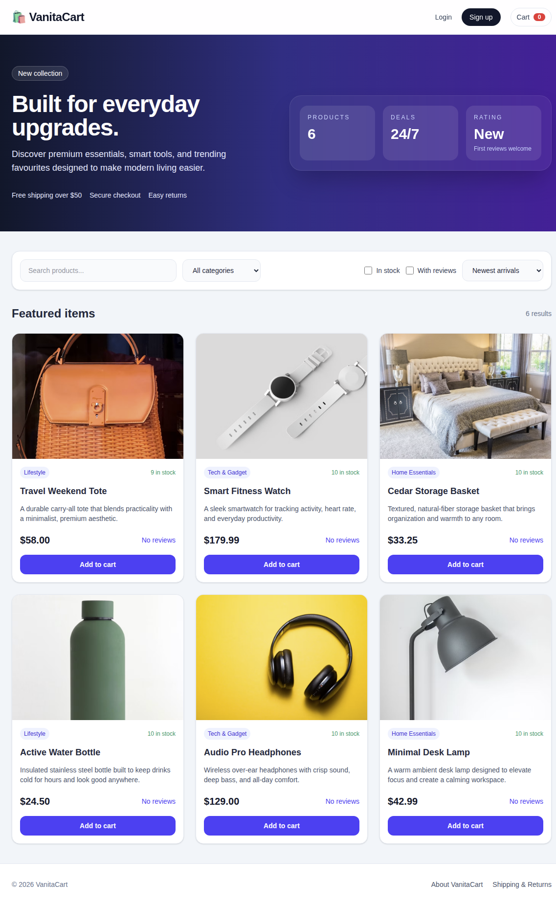
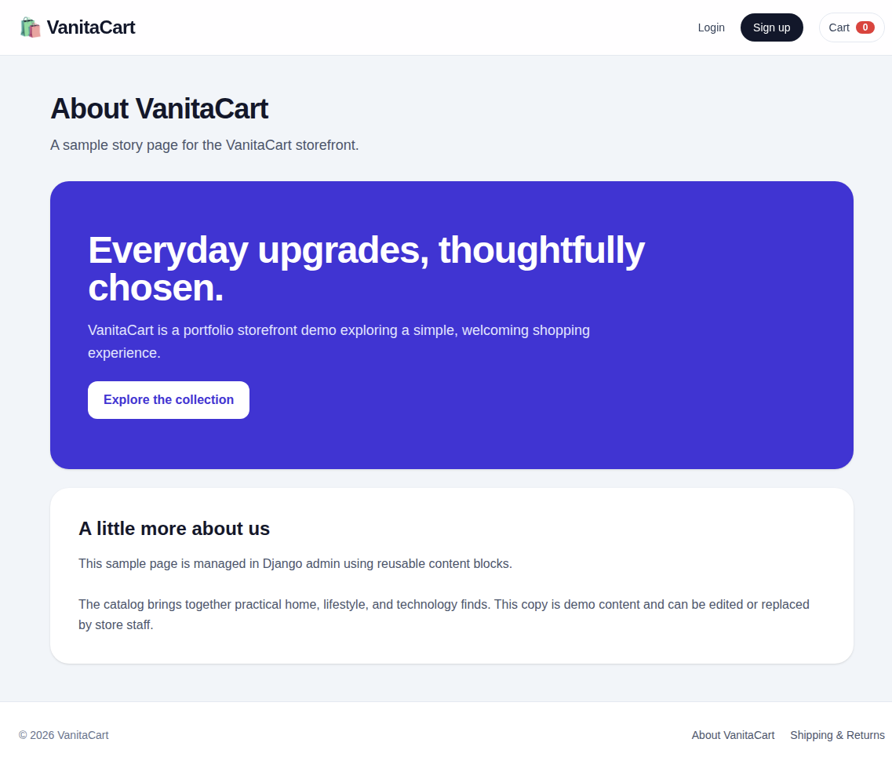
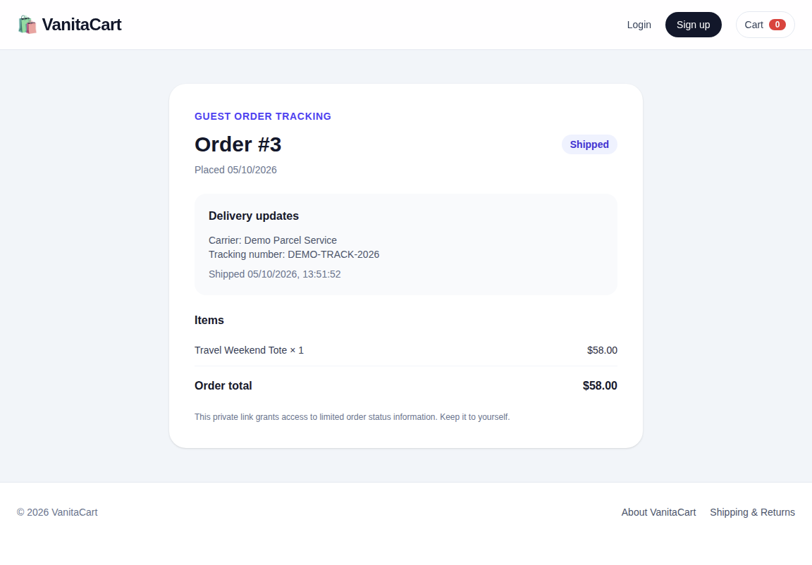
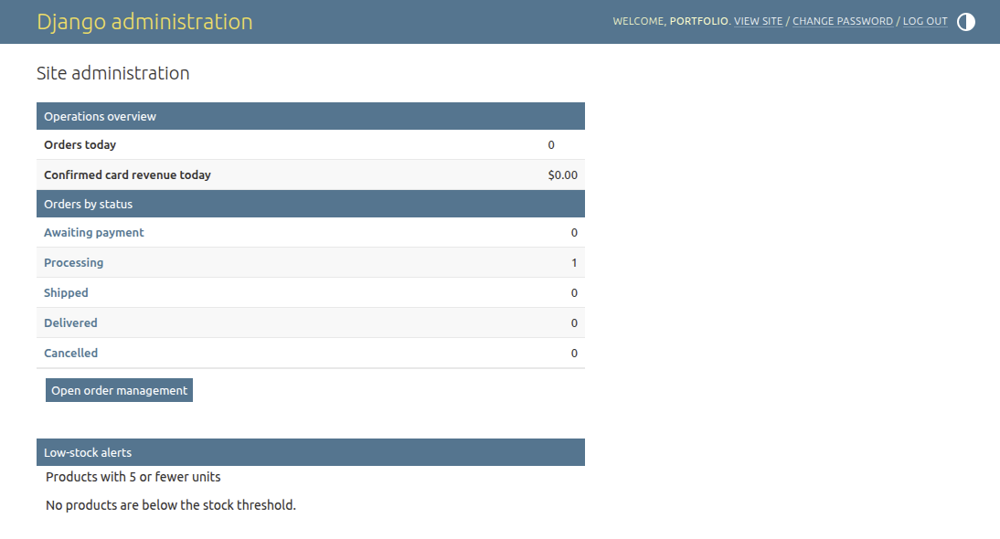

# VanitaCart

A polished full-stack e-commerce storefront built with Django REST Framework and React. This project is designed to showcase real-world product browsing, authentication, cart flows, and checkout logic in a portfolio-ready application.

## Why this project matters for a portfolio

This app demonstrates:

- Full-stack architecture across Django and React
- Secure JWT-based authentication flow
- Protected API endpoints and cart logic
- Product catalog UX with search, filtering, and sorting
- Cart state management and checkout workflow
- Modern frontend styling with Tailwind
- A deployable backend/frontend structure suitable for a job portfolio

## Tech stack

### Frontend
- React
- Vite
- React Router
- Tailwind CSS

### Backend
- Python
- Django
- Django REST Framework
- Django REST Framework Simple JWT

### Data and tooling
- SQLite for local development fallback
- PostgreSQL-ready configuration for production
- CORS configuration
- Environment variable support

## Features

- User signup and login
- JWT access and refresh token flow
- Product list with shareable search, category, stock, and review filters
- Quick add-to-cart actions on catalog cards with stock-aware feedback
- Product detail page
- Product image gallery with staff-managed image ordering
- Customer reviews with one review per account and aggregate ratings
- Cart with quantity updates, per-item totals, stock validation, and visible action errors
- Persistent guest cart and guest checkout with order confirmation and optional account creation
- Product-page quantity selection with stock-validated cart updates
- Stock-aware inventory and checkout validation
- Checkout with saved delivery-detail autofill for members and an order summary
- Stripe-hosted card checkout restricted to test-mode keys, with verified webhooks
- Order creation with validation and order history
- Customer profile management and processing-order cancellation
- Account wishlist with saved products across sessions
- Django admin inventory and order-status management
- Demo catalog seeding with distinct product imagery
- Responsive storefront UI for mobile and desktop



## Project structure

```text
DJango-React-ECommerce-Project/
├── backend/
│   ├── backend/
│   ├── store/
│   ├── manage.py
│   ├── requirements.txt
│   └── .env.example
├── frontend/
│   ├── src/
│   ├── public/
│   ├── package.json
│   └── .env.example
├── README.md
└── .gitignore
```

## Deployment and path migration

To move the existing main-domain app to `/demos/django-react-ecommerce/` beside
the private `/demos/hindi/` app on the same server, see [the deployment guide](./docs/DEPLOY.md).
Bring up and verify the new paths first, then retire the old root route; retain the running backend,
database and media. The guide covers production settings, the React build,
reverse-proxy routing, Stripe URLs, verification and rollback.

The checked-in Django settings are development-only; environment variables
alone do not override the hardcoded debug flag, secret key or allowed hosts.
Use `backend.production_settings` with its required private environment values,
or preserve your existing production settings. Root/sub-domain hosting still
works with the default base path `/`.

For path hosting, set backend `APP_BASE_PATH=/demos/django-react-ecommerce/`
and `FRONTEND_URL=https://vanitatech.co.uk/demos/django-react-ecommerce`.
Build React with `VITE_BASE_PATH=/demos/django-react-ecommerce/` and
`VITE_DJANGO_BASE_URL=/demos/django-react-ecommerce`. Django's proxy must strip
the mount prefix; its media/admin URLs and cookies keep that prefix externally.
Run frontend deployment-helper tests with `npm test` from `frontend/`.

## Local development

Requirements: Python 3.10+ and Node.js 22.12+.

### 1) Backend

```bash
cd backend
cp .env.example .env
python3 -m venv .venv
source .venv/bin/activate
pip install -r requirements.txt
python manage.py migrate
python manage.py seed_store
python manage.py runserver
```

### Optional Stripe test checkout

Card checkout stays disabled unless both Stripe test-mode credentials are
configured. Add your `sk_test_...` key and the webhook signing secret to
`backend/.env`; never use a live key for local testing:

```env
STRIPE_SECRET_KEY=sk_test_...
STRIPE_WEBHOOK_SECRET=whsec_...
FRONTEND_URL=http://localhost:5173
```

Install and authenticate the [Stripe CLI](https://docs.stripe.com/stripe-cli),
then forward test events to the local webhook:

```bash
stripe login
stripe listen --forward-to localhost:8000/api/payments/stripe/webhook/
```

Copy the `whsec_...` value printed by `stripe listen` into
`STRIPE_WEBHOOK_SECRET`, then restart Django. Use Stripe's documented test card
numbers in the hosted checkout; no live payment can be created by this app.
Stripe Checkout sessions reserve stock for 31 minutes. Verified completion
events mark orders paid; expiration releases the reserved stock.
Paid card orders cannot be cancelled through the standard cancellation endpoint
because a refund must be issued first.

### Backend tests

Run the API and customer-journey test suite with:

```bash
cd backend
python3 manage.py test store
```

The automated suite covers registration, JWT issue and refresh, private API
permissions, authenticated and guest purchase journeys, order history and
cancellation, inventory handling, and Stripe session/webhook lifecycle behavior.
Stripe network calls are mocked in tests; use the Stripe CLI instructions above
for a real sandbox smoke test.

### 2) Frontend

```bash
cd frontend
cp .env.example .env
npm install
npm run dev
```

The frontend expects a backend URL in `frontend/.env` (a template is provided at `frontend/.env.example`):

```env
VITE_DJANGO_BASE_URL=http://localhost:8000
```

## API overview

```text
/api/register/
/api/token/
/api/token/refresh/
/api/products/
/api/categories/
/api/cart/
/api/cart/add/
/api/cart/remove/
/api/cart/update/
/api/orders/create/
/api/orders/
/api/orders/track/ # POST { "token": "<private guest tracking token>" }
/api/orders/payment-status/?session_id=<stripe-session-id>
/api/orders/<id>/cancel/
/api/admin/orders/ # Staff-only searchable order queue (status/search filters)
/api/admin/orders/<id>/ # Staff-only fulfilment updates (PATCH)
/api/content/pages/ # Public list of published CMS pages
/api/content/pages/<slug>/ # Public page content and active reusable sections
/api/admin/content/pages/<slug>/preview/ # Staff-only draft/scheduled preview
/api/payments/config/
/api/payments/stripe/webhook/
/api/profile/
/api/wishlist/
/api/wishlist/<product_id>/
/api/products/<id>/reviews/
# GET/POST/PATCH: public reviews, create a review, or edit your own review
```

## What I improved in this version

- Fixed broken JWT auth header handling in the frontend
- Hardened cart and order backend logic with validation
- Added better product filters and storefront polish
- Improved responsive product browsing experience
- Added SQLite fallback so local development works without a Postgres instance
- Added stock tracking, order history, and product reviews
- Added account contact details and safe order cancellation with inventory restoration
- Added a private, persistent wishlist for each customer account
- Added a staff-only order fulfilment queue with guarded shipping transitions,
  optional carrier/tracking details, and customer-visible delivery updates
- Added private guest order tracking links backed by hashed, high-entropy
  tokens and a limited order-status response
- Added a Django admin operations dashboard for order status, today's confirmed
  card revenue, and low-stock products
- Added reusable banner, text, and image content blocks with staff-managed
  publishing, staff-only previews, scheduled publication, and public,
  read-only CMS pages
- Added GitHub Actions CI for backend tests/checks and frontend lint/build
- Strengthened the project story for portfolio and recruiter review

### Managing storefront content

Staff can create reusable content blocks at `/admin/store/contentblock/`, then
create a page at `/admin/store/contentpage/` and attach blocks in display order.
Save a page as a draft until it is ready, then enable **Is published** to make it
appear in the storefront information links. Disabling publication removes it
from public page endpoints.

Content is plain text rather than authored HTML. Image blocks require HTTPS
image URLs, and buttons accept only HTTPS destinations or same-site paths; this
keeps the generic page renderer from executing staff-entered markup or unsafe
link schemes. To preview a draft or scheduled page, sign in to the storefront
with a staff account and use its **Preview** link in Django admin. Set
**Is published** and a future **Published at** time to schedule a page; it will
become public automatically at that time without a background worker.



Guest tracking links act as bearer credentials: anyone with the complete link
can see the order's status, items, total, and shipment tracking fields. The
database stores only a SHA-256 digest of a random token, and the tracking API
does not expose guest email, phone, or delivery address. Ask customers to keep
the link private.



The operations dashboard appears on the Django admin home page at `/admin/`.
It counts orders by status, shows orders placed today, and totals confirmed
Stripe card revenue for today. Cash-on-delivery and simulated payments are
excluded from paid revenue. Low-stock alerts use a five-unit threshold.
The dashboard and the product, order, and CMS tools share Django admin
authentication; visit `http://localhost:8000/admin/` and sign in with a staff
account. The customer-facing React app does not contain a separate staff
dashboard.



## Remaining roadmap

The Stripe sandbox smoke test, customer-facing checkout work, product galleries,
guest checkout, expanded journey coverage, fulfilment tools, CMS, guest order
tracking, and the operations dashboard are complete:

1. **Continue storefront improvements** with customer-facing shopping and account
   flows.
2. **Complete: Stripe Checkout in test mode** with signed webhook verification,
   inventory release on session expiry, and a successful Stripe sandbox
   Checkout/webhook smoke test. Live keys are explicitly rejected.
3. **Complete: expand automated coverage** for authentication, APIs, and
   authenticated and guest customer journeys.
4. **Complete: automated CI checks** for backend configuration, tests and
   migration consistency plus frontend lint and production builds. Cloud
   deployment remains a separate future decision.
5. **Complete: support multiple product images** with a browsable product
   gallery and manageable image ordering, while preserving each product’s
   existing primary image.
6. **Complete: add guest checkout** so customers can place orders without
   creating an account, with a persistent guest cart, clear order confirmation,
   and an optional account-creation path.
7. **Complete: admin order management and fulfilment tools**, including a
   staff-only searchable work queue, forward-only status transitions,
   fulfilment and tracking details, and customer-visible order updates.
8. **Complete: CMS capabilities** for staff to manage published pages and
   reusable banner, text, and image sections through Django admin. Public
   endpoints expose published pages only; staff previews support drafts and
   scheduled publication. Content is rendered as escaped text, and links are
   restricted to HTTPS or same-site paths.
9. **Complete: guest order tracking** through private random-token links, with
   only a token digest stored and contact/address details omitted from lookup
   responses.
10. **Complete: staff operations dashboard** with order status totals, today's
    order count, confirmed card revenue, and low-stock alerts.

## License

This project is intended for learning and portfolio use.
